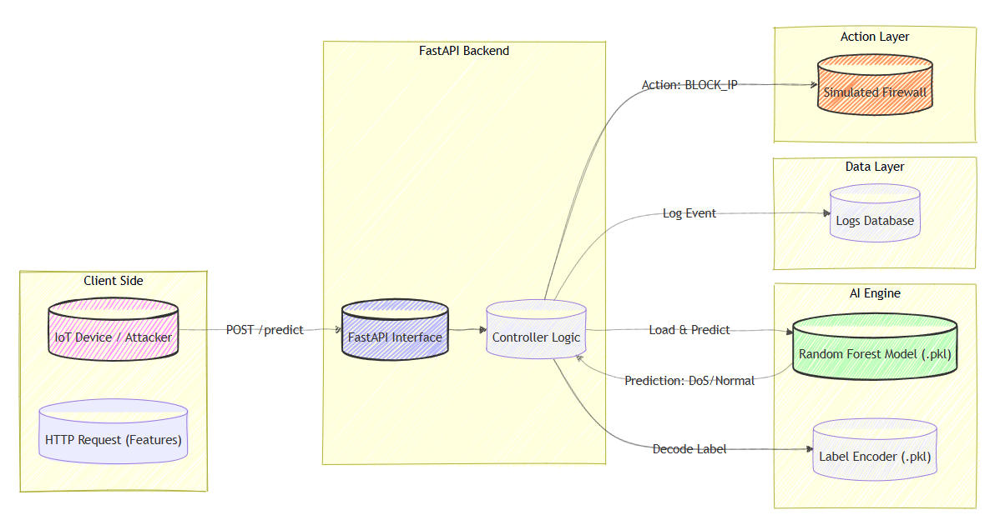

# Real-Time IoT Intrusion Detection System (IDS)



## Overview
This project implements a Machine Learning-based Intrusion Detection System (IDS) designed for IoT environments. It utilizes the **RT-IoT2022 dataset** to detect network attacks (DoS, Brute Force, etc.) in real-time.

The system consists of:
1.  **AI Engine:** A Random Forest Classifier trained to distinguish between Normal and Attack traffic.
2.  **API:** A FastAPI backend that serves the model and simulates Firewall actions.

## Features
* 🚀 **High Accuracy:** Achieved 99.8% accuracy using Random Forest with Class Weighting.
* ⚡ **Real-Time:** Prediction capability via RESTful API.
* 🛡️ **Firewall Simulation:** Automatically generates "BLOCK" rules for detected threats.
* 📊 **Imbalance Handling:** Optimized for detecting minority class attacks (e.g., SSH Brute Force).

## Files in this Repository
* `main.py`: The FastAPI application code.
* `model_training.ipynb`: The Kaggle notebook used for data analysis, preprocessing, and model training.
* `iot_security_model.pkl`: The trained ML model file.
* `label_encoder.pkl`: The encoder used to transform categorical data.

## How to Run

1.  **Install Requirements**
    ```bash
    pip install fastapi uvicorn scikit-learn pandas joblib
    ```

2.  **Run the API**
    ```bash
    python -m uvicorn main:app --reload
    ```

3.  **Test the System**
    Go to `http://127.0.0.1:8000/docs` and use the `/predict` endpoint to simulate attacks.

## Author
**Furkan Kartal** - Computer Engineering Student at Haliç University.
